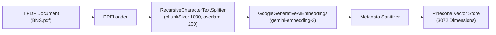

# 📄 Embedding & Ingestion Pipeline Guide

This document details the architecture, design decisions, and error-handling mechanics of the document embedding pipeline in `src/embedding-pipeline.ts`.

---

## 🛠️ Overview

The embedding pipeline is responsible for parsing raw PDF documents, chunking text into optimal sizes for vector search, generating high-dimensional embeddings using Google Gemini AI (`gemini-embedding-2`), and indexing the vectors into Pinecone Vector Database.



---

## 🔑 Key Features & Technical Details

### 1. Vector Dimension Alignment (3072 Dims)
- **Model**: `gemini-embedding-2` from `@langchain/google-genai`
- **Output Vector Dimension**: **`3072`**
- **Index Management**: If the Pinecone index `pdf-embedded-index` exists with a different dimension (e.g. 384 or 768), the pipeline automatically deletes and recreates it with `dimension: 3072` and `waitUntilReady: true`.

---

### 2. Metadata Sanitization for Pinecone Compliance
Pinecone only accepts primitive metadata types (`string`, `number`, `boolean`, `string[]`). PDFs parsed via `PDFLoader` contain complex nested objects (such as `loc: { lines: { from: 1, to: 30 }, pageNumber: 1 }`).

The `sanitizeMetadata` helper converts any nested object or complex array into a stringified JSON string:

```typescript
function sanitizeMetadata(metadata: Record<string, any>) {
  const cleaned: Record<string, string | number | boolean | string[]> = {};
  for (const [key, val] of Object.entries(metadata)) {
    if (val == null) continue;
    if (typeof val === "string" || typeof val === "number" || typeof val === "boolean") {
      cleaned[key] = val;
    } else if (Array.isArray(val) && val.every((item) => typeof item === "string")) {
      cleaned[key] = val;
    } else {
      cleaned[key] = JSON.stringify(val);
    }
  }
  return cleaned;
}
```

---

### 3. Rate Limit Resilience & Fallback Strategy
When sending bulk embedding requests, Gemini free-tier API endpoints can encounter rate limits (HTTP 429). The `embedDocsWithRetry` helper implements a two-tier resilience strategy:

1. **Batch Request**: Attempts `embeddings.embedDocuments(batchTexts)`.
2. **Fallback & Exponential Backoff**: If any vector fails or returns empty (`length 0`), it falls back to item-by-item `embedQuery()` calls with exponential backoff delays up to 5 retries.

```typescript
async function embedDocsWithRetry(
  embeddings: GoogleGenerativeAIEmbeddings,
  texts: string[]
): Promise<number[][]> {
  try {
    const res = await embeddings.embedDocuments(texts);
    if (res.length === texts.length && res.every((v) => v && v.length === 3072)) {
      return res;
    }
  } catch (e) {}

  const results: number[][] = [];
  for (const text of texts) {
    let vec: number[] = [];
    for (let attempt = 1; attempt <= 5; attempt++) {
      try {
        const v = await embeddings.embedQuery(text);
        if (v && v.length === 3072) {
          vec = v;
          break;
        }
      } catch (e) {}
      await new Promise((resolve) => setTimeout(resolve, 1000 * attempt));
    }
    results.push(vec);
  }
  return results;
}
```

---

### 4. Pinecone SDK v8 Compatibility
Pinecone SDK `v8+` requires vector upserts to be wrapped in an object with a `records` key:

```typescript
await namespace.upsert({
  records: batchDocs.map((doc, idx) => ({
    id: `doc-${i + idx}`,
    values: vectors[idx],
    metadata: sanitizeMetadata({
      text: doc.pageContent,
      ...doc.metadata,
    }),
  })),
});
```

---

## 🚀 Execution Command

Run the pipeline using Bun:

```bash
bun src/embedding-pipeline.ts
```
