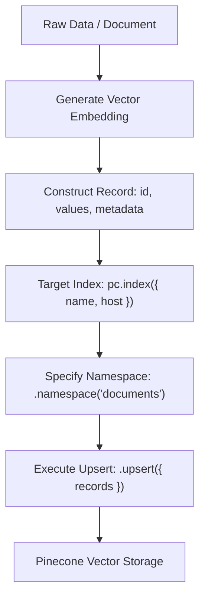

# Pinecone DB Vector Upsertion Guide (TypeScript SDK v4+)

This guide explains how **upsertion** works in Pinecone Vector Database using the latest `@pinecone-database/pinecone` SDK syntax.

---

## 1. What is "Upsert"?

**Upsert** is a combination of **UPDATE** and **INSERT**:
- If a vector record with the given `id` **does not exist**, Pinecone **creates/inserts** it.
- If a vector record with the given `id` **already exists**, Pinecone **overwrites/updates** its vector values and metadata.

---

## 2. Core Concepts & Record Architecture

Every vector record stored in Pinecone consists of three primary fields:

```typescript
type VectorRecord = {
  id: string;             // Unique identifier for the vector record (e.g. "doc-1", UUID)
  values: number[];       // Dense vector embedding array matching the index dimension (e.g. [1.0, 0.0, 0.0])
  metadata?: Record<string, any>; // Optional key-value payload used for metadata filtering
};
```

### Core Hierarchy
1. **Pinecone Client (`pc`)**: Manages connections, index creation, and global configuration.
2. **Index (`pc.index({...})`)**: The vector collection/database.
3. **Namespace (`.namespace(...)`)**: A logical partition inside an index. Operations are scoped to a namespace to segment data (e.g., per user, per document category).

---

## 3. Latest TypeScript SDK Syntax

### Step 1: Initialize the Pinecone Client

#### For Cloud Pinecone:
```typescript
import { Pinecone } from "@pinecone-database/pinecone";

export const pc = new Pinecone({
  apiKey: process.env.PINECONE_DB_API_KEY!,
});
```

#### For Local Pinecone Emulator (Docker):
```typescript
import { Pinecone } from "@pinecone-database/pinecone";

export const pc = new Pinecone({
  apiKey: "pinecone-local",
  controllerHostUrl: "http://jarvis:5080",
});
```

---

### Step 2: Target the Index

Using the modern object syntax `pc.index({ name, host })`:

```typescript
// Target cloud or default index:
const index = pc.index({ name: "my-rag-index" });

// Target local container or explicit host override:
const localIndex = pc.index({
  name: "small-index",
  host: "http://jarvis:5081", // Override host address for local emulator
});
```

---

### Step 3: Upsert Records into a Namespace

Records are upserted into a specific namespace using `.namespace("name").upsert({ records: [...] })`:

```typescript
await pc
  .index({
    name: "small-index",
    host: "http://jarvis:5081",
  })
  .namespace("documents")
  .upsert({
    records: [
      {
        id: "doc-1",
        values: [0.12, 0.45, 0.89], // Dimension size must match index configuration
        metadata: {
          title: "Introduction to RAG",
          category: "education",
          page: 1,
        },
      },
      {
        id: "doc-2",
        values: [0.99, 0.01, 0.33],
        metadata: {
          title: "Pinecone Deep Dive",
          category: "tech",
          page: 2,
        },
      },
    ],
  });

console.log("Upserted successfully!");
```

---

## 4. Summary Workflow Diagram



---

## 5. Key Best Practices

- **Batch Size**: When upserting large datasets, batch vector records in groups of **100–500 vectors** per call for optimal performance.
- **Dimension Matching**: Ensure vector `values` length matches the index `dimension` defined during index creation (e.g. 1536 for OpenAI `text-embedding-3-small`, 384 for `all-MiniLM-L6-v2`).
- **Metadata Types**: Supported metadata value types include `string`, `number`, `boolean`, and arrays of strings (`string[]`).
