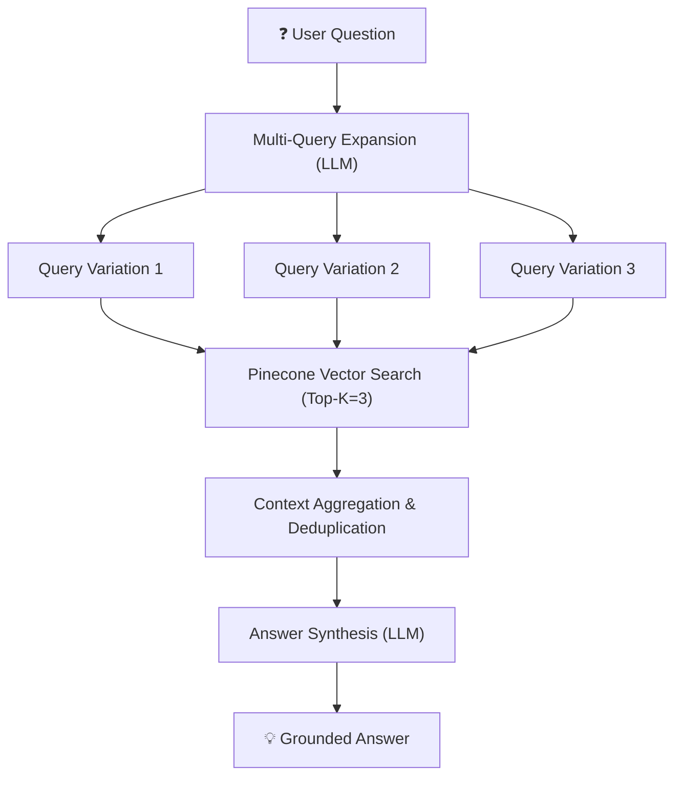

# 🔍 Retrieval & Synthesis Pipeline Guide

This guide explains the multi-query retrieval architecture and response generation implemented in `src/db/retrieving-pipeline.ts` and `src/db/retrieving-pipeline-opencode.ts`.

---

## 🏗️ Architecture & Workflow

Standard RAG systems often fail when a user's original query uses different terminology than the indexed document chunks. To overcome this, our pipeline uses **Multi-Query Transformation**:



---

## 🌟 Available Implementations

| Pipeline File | Embeddings Model | LLM Provider / Model | Protocol / SDK |
| :--- | :--- | :--- | :--- |
| `src/db/retrieving-pipeline.ts` | `gemini-embedding-2` (3072 dims) | `gemini-2.5-flash` | `@langchain/google-genai` |
| `src/db/retrieving-pipeline-opencode.ts` | `gemini-embedding-2` (3072 dims) | `x-preview-f-free` | OpenCode Zen API (`https://opencode.ai/zen/v1/chat/completions`) |

---

## 🛠️ Step-by-Step Implementation Details

### Step 1: Multi-Query Transformation
The pipeline prompts the LLM to step back, understand user intent, and rewrite the query into 3 distinct semantic variations:

```typescript
const QUERY_TRANSFORMATION_PROMPT = PromptTemplate.fromTemplate(`
You are an expert at query rewriting for semantic search and retrieval-augmented generation (RAG).
Generate 3 alternative rewritten queries that better express the same intent.
Original question: {question}
`);
```

---

### Step 2: Parallel Vector Search & Deduplication
Each rewritten query is embedded using `gemini-embedding-2` and searched against Pinecone:

```typescript
const docPromises = queries.map((q) => queryVectorDB(q, 3));
const nestedDocs = await Promise.all(docPromises);

// Deduplicate retrieved chunks by pageContent
const allDocs = nestedDocs.flat();
const uniqueDocs = Array.from(
  new Map(allDocs.map((doc) => [doc.pageContent, doc])).values()
);
```

---

### Step 3: Response Synthesis
The aggregated context chunks are formatted as plain text and passed to the LLM alongside the original query:

```typescript
export const GENERATE_RESPONSE_PROMPT = PromptTemplate.fromTemplate(`
You are an assistant for question-answering tasks. Use the following pieces of retrieved context to answer the question.
If you don't know the answer, just say that you don't know.

Question: {question}
Context: {context}
Answer:
`);
```

---

## ⚡ Execution Commands

### Run Gemini 2.5 Flash Pipeline:
```bash
bun src/db/retrieving-pipeline.ts
```

### Run OpenCode Zen API Pipeline (`x-preview-f-free`):
```bash
bun src/db/retrieving-pipeline-opencode.ts
```
