# 🚀 RAG TypeScript (rag-ts)

A high-performance, TypeScript-based Retrieval-Augmented Generation (RAG) system built with **Bun**, **LangChain**, **Google Gemini AI**, and **Pinecone Vector Database**.

---

## 🏗️ Architecture Overview

```mermaid
flowchart TD
    subgraph Ingestion["1. Document Embedding Pipeline"]
        PDF["📄 PDF Document (BNS.pdf)"] --> Loader["PDFLoader (LangChain)"]
        Loader --> Splitter["RecursiveCharacterTextSplitter"]
        Splitter --> Embedder["GoogleGenerativeAIEmbeddings (gemini-embedding-2)"]
        Embedder --> Sanitizer["Metadata Sanitizer & Batching"]
        Sanitizer --> PineconeIndex[("Pinecone Vector DB (3072 Dim)")]
    end

    subgraph Retrieval["2. Multi-Query Retrieval & Synthesis Pipeline"]
        UserQuery["❓ User Question"] --> QueryRewriter["Query Rewriter (LLM)"]
        QueryRewriter --> Q1["Query Variation 1"]
        QueryRewriter --> Q2["Query Variation 2"]
        QueryRewriter --> Q3["Query Variation 3"]
        
        Q1 --> PineconeSearch["Pinecone Vector Search"]
        Q2 --> PineconeSearch
        Q3 --> PineconeSearch
        
        PineconeSearch --> ContextDedupe["Context Aggregation & Deduplication"]
        ContextDedupe --> SynthesisLLM["LLM Answer Synthesis (Gemini / OpenCode Zen)"]
        SynthesisLLM --> FinalAnswer["💡 Final Grounded Response"]
    end
```



---

## 📦 Technology Stack

- **Runtime & Package Manager**: [Bun](https://bun.com) (`v1.3+`)
- **Language**: TypeScript (`v5+`)
- **Orchestration**: [LangChain](https://js.langchain.com/) (`@langchain/core`, `@langchain/google-genai`, `@langchain/pinecone`)
- **Embeddings Model**: Google Gemini (`gemini-embedding-2` – 3072 dimensions)
- **Generative LLM Models**:
  - `gemini-2.5-flash` via `@langchain/google-genai`
  - `x-preview-f-free` via OpenCode Zen API (`https://opencode.ai/zen/v1/chat/completions`)
- **Vector Database**: [Pinecone](https://www.pinecone.io/) (SDK `v8+`)
- **CLI & Utilities**: `cli-progress`, `zod`, `@langchain/community`

---

## 📂 Project Structure

```text
server/
├── src/
│   ├── data/
│   │   └── BNS.pdf                  # Knowledge base source PDF document
│   ├── db/
│   │   ├── pinecone.ts              # Pinecone client initialization
│   │   ├── retrieving-pipeline.ts   # Main RAG Pipeline (Google Gemini LLM)
│   │   └── retrieving-pipeline-opencode.ts # Alternative RAG Pipeline (OpenCode Zen API)
│   ├── embedding-pipeline.ts        # PDF Chunking, Embedding & Progress-bar Upsert
│   └── learn-pinecone.ts            # Pinecone CRUD cheat sheet & verification script
├── docs/
│   └── pinecone-upsert.md           # Comprehensive Pinecone SDK v8 operations guide
├── .env                             # Environment configuration (API Keys)
├── package.json                     # Dependencies & scripts
├── tsconfig.json                    # TypeScript configuration
└── README.md                        # Project documentation
```

---

## ⚡ Quick Start

### 1. Prerequisites & Environment Setup

Ensure you have **Bun** installed on your system.

Create a `.env` file in the root directory:

```env
GOOGLE_API_KEY=your_google_gemini_api_key_here
PINECONE_DB_API_KEY=your_pinecone_api_key_here
```

### 2. Install Dependencies

```bash
bun install
```

---

## 🛠️ Usage

### A. Run Document Embedding Pipeline

Splits `BNS.pdf`, generates 3072-dimensional Gemini embeddings, and upserts them into Pinecone with a CLI progress bar:

```bash
bun src/embedding-pipeline.ts
```

**Key Features:**
- **Automatic Index Management**: Creates or recreates `pdf-embedded-index` if dimension mismatches occur.
- **Pinecone SDK v8 Compliance**: Uses `{ records }` structured payloads.
- **Metadata Sanitization**: Automatically flattens and converts nested document metadata into Pinecone-compliant types.
- **Rate-Limit Resilience**: Includes exponential backoff retries and fallback to `embedQuery()` for 100% chunk coverage.

---

### B. Run Retrieval & Response Pipeline (Gemini 2.5 Flash)

Executes multi-query transformation, retrieves relevant context chunks from Pinecone, and synthesizes answers using Google Gemini:

```bash
bun src/db/retrieving-pipeline.ts
```

---

### C. Run Alternative Retrieval Pipeline (OpenCode Zen API)

Executes multi-query retrieval and synthesizes answers using the OpenCode Zen API endpoint (`x-preview-f-free` model):

```bash
bun src/db/retrieving-pipeline-opencode.ts
```

---

### D. Verify Vector Index & Stored Records

Run index statistics and fetch sample document records:

```bash
bun -e 'import { pc } from "./src/db/pinecone"; const idx = pc.index({ name: "pdf-embedded-index", host: "http://jarvis:5080" }); console.log(await idx.describeIndexStats());'
```

---

## 📚 Documentation & Guides

For detailed code snippets and operations on Pinecone SDK v8 (upsert, query, metadata filter, delete, update), refer to:
- 📖 [Pinecone DB Operations Guide](docs/pinecone-upsert.md)
