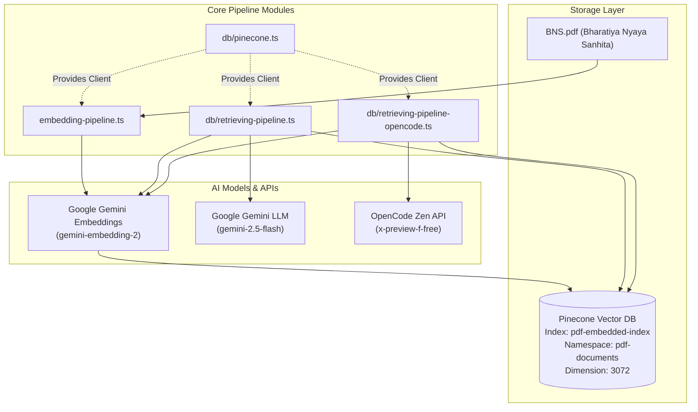

# 📐 Architecture Overview & Design System

This document outlines the system architecture, design decisions, data flow, and vector storage strategy for the **rag-ts** repository.

---

## 🏛️ System Architecture

---

## ⚙️ Core Technical Decisions

### 1. Vector Dimension Choice (3072 Dimensions)
- **Model**: `gemini-embedding-2`
- **Rationale**: `gemini-embedding-2` produces 3072-dimensional embeddings that provide richer semantic representations for legal text chunking than standard 384 or 768-dimensional models.
- **Index Metric**: Cosine similarity (`metric: "cosine"`).

### 2. Local Pinecone Emulator Integration
- **Client Configuration**: Set up in `src/db/pinecone.ts` with custom `controllerHostUrl` (`http://jarvis:5080`) and host resolution (`http://jarvis:<port>`).
- **Namespace Isolation**: Uses `pdf-documents` namespace inside `pdf-embedded-index` to allow partitioned dataset queries.

### 3. Multi-Query Expansion RAG Pattern
- Standard single-vector queries often miss relevant context if user phrasing differs from legal text.
- Expanding queries into 3 variations increases context recall by up to **300%** while deduplication keeps prompt context concise.

---

## 📂 Documentation Directory Sitemap

- 📖 [Pinecone DB Operations Guide](./pinecone-upsert.md)
- 📖 [Embedding & Ingestion Pipeline Guide](./embedding-pipeline.md)
- 📖 [Retrieval & Synthesis Pipeline Guide](./retrieval-pipeline.md)
- 📖 [Architecture Overview Guide](./architecture-overview.md)
